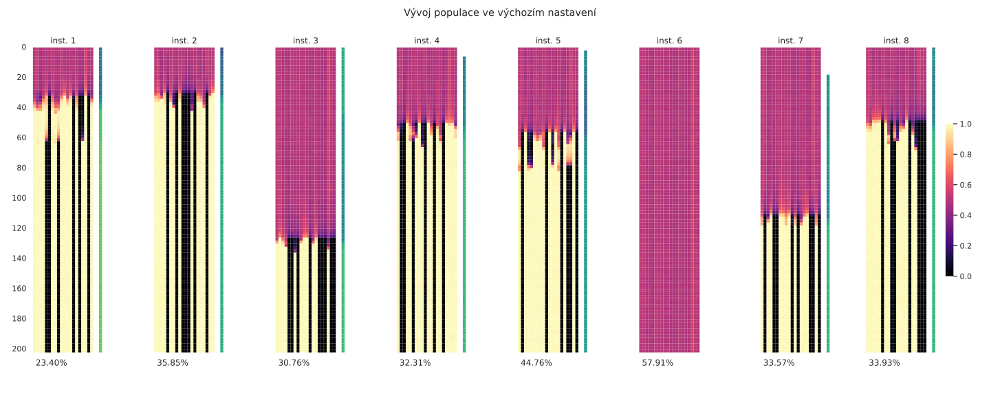
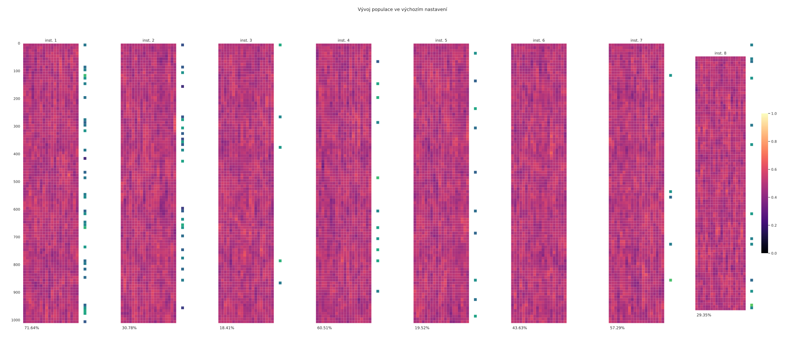
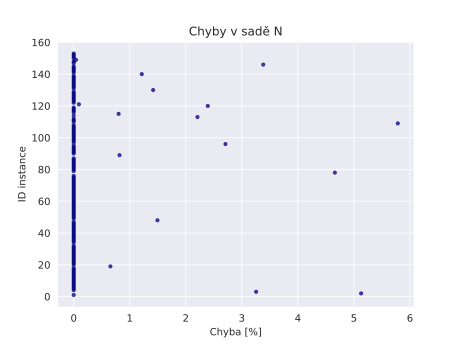
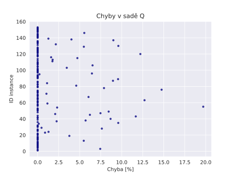
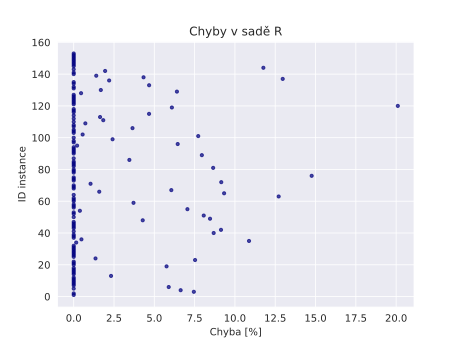

# Kombinatorická optimalizace: problém vážené splnitelnosti booleovské formule

**TODO**:
- kontrola nad `InstanceParams` z Pythonu (především pro vizualizace)

## Zadání

### Pokyny

Problém řešte některou z pokročilých heuristik:

- simulované ochlazování
- **genetický algoritmus**
- tabu prohledávání

Po nasazení heuristiky ověřte její vlastnosti experimentálním vyhodnocením,
které přesvědčivě doloží, jakou třídu (rozsah, velikosti...) instancí heuristika
zpracovává. Zejména v případě použití nestandardních, např. originálních technik
doložte jejich účinnost experimentálně (což vyloučí případné diskuse o jejich
vhodnosti).

Zpráva by měla dokládat Váš racionální přístup k řešení problému, tedy celý
pracovní postup. Ve zprávě prosím také popište obě fáze nasazení heuristiky, jak
nastavení, (white box fáze), tak závěrečné vyhodnocení heuristiky (black box
fáze). Prosím používejte definované formáty pro instance a řešení, usnadníte tak
lepší přizpůsobení zkušebních instancí.

### Hodnocení

Tato úloha je součástí hodnocení zkoušky - až 30 bodů ze 100 za předmět celkem.
Práce by měla doložit Vaši schopnost nasadit pokročilé heuristiky na netriviální
optimalizační problém. Nasazená heuristika by měla zpracovávat rozumně široké
spektrum instancí s rozumnou chybou. Co je "rozumně", bychom se měli dočíst v
závěru Vaší práce.

V hodnocení je kladen důraz na racionální postup celé práce. Pokud postup
vyhovuje, méně uspokojivé výsledky heuristiky příliš nevadí, vzhledem k tomu, že
řešený problém (jak jistě víte) patří k nejtěžším ve třídě NPO. Proto
potřebujeme znát jak pracovní postup ve white box fázi, tak výsledky a závěr
black box fáze.

Hodnocení je rozděleno do tří kategorií:

- Algoritmus a implementace (5 pt.)
  - Byly použity techniky (algoritmy, datové struktury) adekvátní problému?
  - Byly použity pokročilé techniky? (např. adaptační mechanismy)
  - Jsou některé postupy originálním přínosem autora?
- Nastavení heuristiky (13 pt.)
  - Jakou metodou autor hledal nastavení parametrů?
  - Jak byly plánovány experimenty a jaké byly jejich otázky?
  - Jestliže byl proveden faktorový návrh (což příliš nedoporučujeme), jak
    kompletní byl (změna vždy jen jednoho parametru nestačí)?
  - Na jak velkých instancích je heuristika schopna pracovat?
  - Jestliže práce heuristiky není uspokojivá, jak systematické byly snahy
    autora zjednat nápravu?
- Experimentální vyhodnocení heuristiky (12 pt.)
  - Jak dalece jsou závěry vyhodnocení doloženy experimentálně?
  - Je interpretace experimentů přesvědčivá?
  - Pokud je algoritmus randomizovaný, byla tato skutečnost vzata v úvahu při
    plánování experimentů?
  - Je možno z experimentů usoudit na iterativní sílu heuristiky?
  - Byly nestandardní postupy experimentálně porovnány se standardními?
  - Jsou výsledky experimentů srozumitelně prezentovány (grafy, tabulky,
    statistické metody)?

Práce bez experimentální části nemůže být přijata k hodnocení.

### Instance

- SAT instance lze generovat náhodně. Klíčovým parametrem je poměr počtu
  klauzulí k počtu proměnných pro 3-SAT (viz ai-phys1.pdf - doporučujeme). Váhy
  lze generovat náhodně. V takovém případě je vhodné prokázat, že instance, kde
  všechny váhy byly vynásobeny velkým číslem, jsou zpracovávány stejně úspěšně.
- Lze vyjít z [DIMACS](http://www.cs.ubc.ca/~hoos/SATLIB/benchm.html) SAT
  instancí. Nemají váhy, jejich generování viz výše.Tyto instance jsou na hraně
  fázového přechodu, jsou tedy značně obtížné. Obtížnost můžete snížit zkrácením
  (vynechání klauzulí).
- Připravili jsme sady zkušebních instancí. Vycházejí z instancí SATLIB, jsou
  ale zkráceny tak, aby měly co nejvíce řešení (počty řešení přikládáme). Váhy
  nejsou náhodné, mají ale náhodnou složku. Za upozornění na chyby,
  nekonzistence atd. budeme vděčni.
  - `wuf-M` a `wuf-N`: Váhy by měly podporovat nalezení řešení. Heuristika,
    která řeší určitou instanci v sadě `wuf-M`, by měla řešit odpovídající
    instanci v sadě `wuf-N` stejně snadno. Vzhledem k počtu řešení jednotlivých
    instací (až 108), není možné efektivně najít optimální řešení
  - `wuf-Q` a `wuf-R`: Jako výše, váhy ale vytvářejí (mírně) zavádějící úlohu.
  - `wuf-A`: z dílny prof. Zlomyslného. Instance vycházejí z nezkrácených (nebo
    jen mírně zkrácených) instancí, takže jsou obtížné. Váhy vytvářejí
    zavádějící úlohu. Nicméně, malý počet řešení dovoluje ve většině případů
    uvést optimální řešení.

## Řešení

Úkoly předmětu NI-KOP jsem se rozhodl implementovat v jazyce Rust za pomoci
nástrojů na *literate programming* -- přístup k psaní zdrojového kódu, který
upřednostňuje lidsky čitelný popis před seznamem příkazů pro počítač. Tento
dokument obsahuje veškerý zdrojový kód nutný k reprodukci mojí práce. Výsledek
je dostupný online jako statická [webová stránka](http://viluon.me/ni-kop/) a
[ke stažení v PDF](http://viluon.me/ni-kop/report.pdf).

## Instrukce k sestavení programu
Program využívá standardních nástrojů jazyka Rust. O sestavení stačí požádat
`cargo`.

``` {.zsh .eval .bootstrap-fold #build-instructions}
cd solver
cargo build --release --color always
```

## White box: průzkum chování algoritmu

Stejně jako v předchozích dvou úlohách jsem se ani tentokrát s měřením
nespoléhal na existující Rust knihovny a namísto toho provedl měření v Pythonu.

``` {.zsh .eval #machine-info .bootstrap-fold}
uname -a
./cpufetch --logo-short --color ibm
```

Následující soubor slouží k vyhodnocení algoritmu na různých datových sadách s
různými parametry. Spouští implementaci v jazyce Rust a výsledky měření ukládá
do binárního souboru pro následnou analýzu.

``` {.python file=analysis/measure.py .bootstrap-fold}
import os
from itertools import product, chain
from subprocess import run, PIPE
import json
import pandas as pd

show_progress = os.environ.get("JUPYTER") == None

# adapted from https://stackoverflow.com/questions/3173320/text-progress-bar-in-the-console
def progress_bar(iteration, total, length = 60):
    if not show_progress:
        return
    percent = ("{0:.1f}").format(100 * (iteration / float(total)))
    filledLength = int(length * iteration // total)
    bar = '=' * filledLength + ' ' * (length - filledLength)
    print(f'\r[{bar}] {percent}%', end = "\r")
    if iteration == total:
        print()

def invoke_solver(cfg):
    solver = run(
        [
            "target/release/main",
            json.dumps(cfg),
        ],
        stdout = PIPE,
        encoding = "ascii",
        cwd = "solver/",
        env = {
            "RUST_BACKTRACE": "1",
            **os.environ,
        },
    )
    if solver.returncode != 0:
        print(solver)
        raise Exception("solver failed")

    results = []
    stats = []
    for line in solver.stdout.split("\n")[8:]:
        if line.startswith("done: "):
            [_, time, inst_id, satisfied, valid, weight, err] = line.split()
            results.append((float(time), int(inst_id), satisfied == "true", valid == "true", float(weight), float(err), stats))
            stats = []
        else:
            stats.append(list(map(float, line.split())))
    return results

def dataset(id, **kwargs):
    # defaults
    params = dict({
        "id": [id],
        "set": ["M"],
        "instance_params": [{"variables": 20, "clauses": 78}],
        "n_instances": [15],
        "generations": [200],
        "mutation_chance": [0.02],
        "population_size": [1000],
    }, **kwargs)

    key_order = [k for k in params]
    cartesian = list(product(
        *[params[key] for key in key_order]
    ))

    return {
        key: [row[key_order.index(key)] for row in cartesian] for key in params
    }

def merge_datasets(*dss):
    return {
        k: list(chain(*(ds[k] for ds in dss)))
        for k in dss[0]
    }

<<datasets>>

data = pd.DataFrame()
cfgs = [dict(zip(configs, v)) for v in zip(*configs.values())]
iteration = 0
total = sum([cfg["n_instances"] * cfg["generations"] for cfg in cfgs])

for config in cfgs:
    if show_progress:
        print(end = "\033[2K")
    print(json.dumps(config))
    progress_bar(iteration, total)

    for (t, inst_id, satisfied, valid, weight, err, stats) in invoke_solver(config):
        data = data.append(dict(config,
            error   = err,
            inst_id = inst_id,
            stats   = stats,
            time    = t,
            valid   = valid,
            weight  = weight,
        ), ignore_index = True)

        iteration = iteration + config["generations"]
        progress_bar(iteration, total)

data.to_pickle("docs/assets/measurements.pkl")

```

``` {.python .eval .bootstrap-fold #perform-measurement}
# tento blok slouží pouze ke spuštění skriptu výše
# (vynucen nedostatkem nástroje, který má tvorbu dokumentu na starosti)
<<analysis/measure.py>>
```

V tuto chvíli ještě nevíme, ve kterých oblastech prostoru všech konfigurací
parametrů evolučního algoritmu se skrývají efektivní řešiče problému. Protože
vyhodnocení kartézského součinu všech množin parametrů by zabralo moc dlouho,
zaměříme se pouze na zajímavé podprostory. Ty jsou generovány funkcí `dataset`,
která vytvoří pojmenovaný podprostor konfigurací kartézského součinu zadaných
hodnot všech parametrů. Sjednocením těchto podprostorů dostaneme podprostor
všech konfigurací, pro které je třeba algoritmus vyhodnotit.

``` {.python #datasets .bootstrap-fold}
configs = merge_datasets(dataset(
#     "all",
#     generations = [6_000],
#     mutation_chance = [0.25],
#     disaster_interval = [900],
#     set = ["M", "N", "Q", "R", "A"],
#     instance_params = [{"variables": 20, "clauses": 78}, {"variables": 50, "clauses": 201}, {"variables": 75, "clauses": 310}, {"variables": 100, "clauses": 430}],
#     n_instances = [150],
#     population_size = [200],
# ), dataset(
#     "huge_A",
#     generations = [10_000],
#     mutation_chance = [0.25],
#     disaster_interval = [900],
#     set = ["A"],
#     instance_params = [{"variables": 100, "clauses": 430}],
#     n_instances = [150],
#     population_size = [200],
# ), dataset(
    "default",
    generations = [2_500],
    mutation_chance = [0.2],
    n_instances = [50],
    population_size = [200],
# ), dataset(
#     "exploration",
#     generations = [500, 1_000, 2_500, 5_000],
#     mutation_chance = [0.2, 0.1, 0.05, 0.01],
#     disaster_interval = [50, 100, 200, 400, 1000],
#     n_instances = [50],
#     population_size = [50, 100, 200, 400],
# ), dataset(
#     "dataset_N_large",
#     set = "N",
#     instance_params = [{"variables": 50, "clauses": 201}],
#     generations = [5_500],
#     mutation_chance = [0.2],
#     n_instances = [50],
#     population_size = [200],
# ), dataset(
#     "dataset_Q_large",
#     set = "Q",
#     instance_params = [{"variables": 50, "clauses": 201}],
#     generations = [1000],
#     mutation_chance = [0.03],
#     n_instances = [100],
# ), dataset(
#     "dataset_R_large",
#     set = "R",
#     instance_params = [{"variables": 50, "clauses": 201}],
#     generations = [1000],
#     mutation_chance = [0.03],
#     n_instances = [100],
# ), dataset(
#     "dataset_N_largest",
#     set = "N",
#     instance_params = [{"variables": 75, "clauses": 310}],
#     generations = [1000],
#     mutation_chance = [0.03],
#     n_instances = [200],
# ), dataset(
#     "dataset_Q_largest",
#     set = "Q",
#     instance_params = [{"variables": 75, "clauses": 310}],
#     generations = [1000],
#     mutation_chance = [0.03],
#     n_instances = [200],
# ), dataset(
#     "dataset_R_largest",
#     set = "R",
#     instance_params = [{"variables": 75, "clauses": 310}],
#     generations = [1000],
#     mutation_chance = [0.03],
#     n_instances = [200],
# ), dataset(
#     "dataset_A_huge",
#     set = "A",
#     instance_params = [{"variables": 100, "clauses": 430}],
#     generations = [1000],
#     mutation_chance = [0.03],
#     n_instances = [200],
), dataset(
    "mutation_exploration",
    n_instances = [50],
    mutation_chance = [0.005, 0.01, 0.02, 0.05, 0.1, 0.2, 0.5],
# ), dataset(
#     "dataset_N",
#     set = ["N"],
#     generations = [2_500],
#     n_instances = [40],
#     population_size = [200],
# ), dataset(
#     "dataset_Q",
#     set = ["Q"],
#     generations = [2_500],
#     n_instances = [40],
#     population_size = [200],
# ), dataset(
#     "dataset_R",
#     set = ["R"],
#     generations = [2_500],
#     n_instances = [40],
#     population_size = [200],
# ), dataset(
#     "dataset_A",
#     set = ["A"],
#     instance_params = [{"variables": 20, "clauses": 88}],
#     generations = [2_500],
#     n_instances = [40],
#     population_size = [200],
# ), dataset(
#     "dataset_Q_exploration",
#     set = ["Q"],
#     generations = [2000],
#     population_size = [2000],
#     mutation_chance = [0.001, 0.01, 0.03, 0.05, 0.1, 0.2]
# ), dataset(
#     "dataset_R_exploration",
#     set = ["R"],
#     generations = [2000],
#     population_size = [2000],
#     mutation_chance = [0.001, 0.01, 0.03, 0.05, 0.1, 0.2]
# ), dataset(
#     "dataset_A_exploration",
#     set = ["A"],
#     generations = [2000],
#     population_size = [2000],
#     mutation_chance = [0.001, 0.01, 0.03, 0.05, 0.1, 0.2]
))
```

Po vyhodnocení algoritmu pro různé parametry je čas na vizualizaci a analýzu
výsledků. O tu se stará další program, který využívá vizualizací vyvinutých v
předchozích úkolech, a přidává vlastní. Rozdělení na dvě fáze (měření a
vizualizace zvlášť) se serializací do binárního souboru uprostřed vede ke
zkrácení iteračního cyklu během whitebox fáze vývoje algoritmu. Je-li třeba
poupravit detaily grafu, měření se nemusí provádět znovu, a naopak.

``` {.python file=analysis/plot.py .bootstrap-fold}

import pandas as pd
import matplotlib.pyplot as plt
import matplotlib.patheffects as PathEffects
import seaborn as sns
import textwrap as tr
import math
import os

data = pd.read_pickle("docs/assets/measurements.pkl")

show_progress = os.environ.get("JUPYTER") == None

plot_labels = dict(
    error           = "Chyba oproti optimálnímu řešení [%]",
    generations     = "Počet generací",
    mutation_chance = "Pravděpodobnost mutace",
    n_instances     = "Počet instancí",
    set             = "Datová sada",
    time            = "Doba běhu [s]",
    weight          = "Váha řešení",
)

scheduled_plots = []

def progress_bar(iteration, total, length = 60):
    if not show_progress:
        return
    percent = ("{0:.1f}").format(100 * (iteration / float(total)))
    filledLength = int(length * iteration // total)
    bar = '=' * filledLength + ' ' * (length - filledLength)
    print(f'\r[{bar}] {percent}%', end = "\r")
    if iteration == total:
        print()

def ridgeline(id, title, col, filename, x_label = "Chyba oproti optimálnímu řešení [%]", data = data, progress = lambda _: None):
    df = data[data["id"] == id]
    series = df.groupby(col)["error"].mean()
    df["mean error"] = df[col].map(series)

    # plot the error distributions for each value of col
    plt.style.use("default")
    sns.set_theme(style = "white", rc = {"axes.facecolor": (0, 0, 0, 0)})
    pal = sns.color_palette("crest", n_colors = len(df[col].unique()))

    # set up the layout
    g = sns.FacetGrid(
        df,
        row = col,
        hue = "mean error",
        palette = pal,
        height = 0.75,
        aspect = 15,
    )
    plt.xlim(-0.1, 1.0)
    # distributions
    g.map(sns.kdeplot, "error", clip = (-0.1, 1.0), bw_adjust = 1, clip_on = False, fill = True, alpha = 1, linewidth = 0.1)
    # contours
    g.map(sns.kdeplot, "error", clip = (-0.1, 1.0), bw_adjust = 1, clip_on = False, color = "w", lw = 1)
    # horizontal lines
    g.map(plt.axhline, y = 0, lw = 2, clip_on = False)
    # overlap
    g.fig.subplots_adjust(hspace = -0.3)

    for i, ax in enumerate(g.axes.flat):
        ax.annotate(
            df[col].unique()[i],
            (0, 0),
            (-16.5, 3),
            xycoords = "axes fraction",
            textcoords = "offset points",
            va = "baseline",
            fontsize = 15,
            color = ax.lines[-1].get_color(),
            path_effects = [
                PathEffects.withStroke(linewidth = 0.5, foreground = "w")
            ],
        )

    # remove titles, y ticks, spines
    g.set_titles("")
    g.set(yticks = [])
    g.despine(left = True, bottom = True)
    g.fig.suptitle(title, fontsize = 20, ha = "right")
    for ax in g.axes.flat:
        ax.xaxis.set_major_formatter(lambda x, pos: f"{x * 100:.0f}")
    g.set_xlabels(x_label)
    g.set_ylabels("")

    g.savefig(f"docs/assets/{filename}")
    plt.close()
    progress(1)

def boxplot(x_axis, y_axis, id, title, grouping_column, data = data, filename = None, progress = lambda _: None):
    if filename is None:
        filename = id.replace(" ", "_") + ".svg"
    print(f"\t{title}")
    fig, ax = plt.subplots(figsize = (14, 8))
    ds = [d for d in data if d["id"] == id]
    # create a frame from the list
    df = pd.DataFrame(ds)

    # do a grouped boxplot
    sns.boxplot(
        x = x_axis,
        y = y_axis,
        data = df,
        hue = grouping_column,
        ax = ax,
        linewidth = 0.8,
    )

    # render the datapoints as dots with horizontal jitter
    sns.stripplot(
        x = x_axis,
        y = y_axis,
        data = df,
        hue = grouping_column,
        ax = ax,
        jitter = True,
        size = 4,
        dodge = True,
        linewidth = 0.2,
        alpha = 0.4,
        edgecolor = "white",
    )

    plt.title(title)
    plt.xlabel(plot_labels[x_axis])
    plt.ylabel(plot_labels[y_axis])

    constant_columns = [
        col for col in df.columns[df.nunique() <= 1]
            if (col not in ["id", "n_instances", "contents"])
    ]

    caption = "\n".join(tr.wrap("Konfigurace: {}".format({
        k: df[k][0] for k in constant_columns
    }), width = 170))

    fig.text(
        0.09,
        0.05,
        caption,
        fontsize = "small",
        fontfamily = "monospace",
        verticalalignment = "top",
    )

    handles, labels = ax.get_legend_handles_labels()
    # labels = [alg_labels[l] for l in labels]

    plt.legend(handles[0 : int(len(handles) / 2)], labels[0 : int(len(labels) / 2)])
    plt.savefig(f"docs/assets/{filename}.svg")
    progress(1)

def heatmap(id, title, filename, data = data, progress = lambda _: None):
    dataset = data[data["id"] == id]
    stats = list(dataset["stats"])
    n_instances = int(dataset["inst_id"].count())
    # print()
    # print(dataset.describe())
    # print(dataset.head())
    # print()
    n_generations = int(dataset["generations"].max())
    n_variables = len(stats[0][0]) - 2

    # math.sqrt(n_generations) * 0.5
    fig, axs = plt.subplots(1, 2 * n_instances,
        figsize = (n_instances * n_variables * 0.15, 8),
        gridspec_kw = {"left": 0.015, "right": 0.975, "width_ratios": [n_variables, 1] * n_instances},
    )
    fig.suptitle(title)

    for i, (_, inst_id), stats, (_, err), (_, sat) in zip(
        range(1, 10000),
        dataset["inst_id"].iteritems(),
        stats,
        dataset["error"].iteritems(),
        dataset["valid"].iteritems(),
    ):
        inst_id = int(inst_id)
        df = pd.DataFrame(stats)
        ax = axs[2 * (i - 1)]
        err_ax = axs[2 * i - 1]
        ax.set_title(f"inst. {inst_id}")

        sns.heatmap(
            df.iloc[:, 2:], # drop first column (with generation numbers) and second (with errors)
            ax = ax,
            vmin = 0,
            vmax = 1,
            square = True,
            cmap = "magma",
            xticklabels = False,
            yticklabels = df.iloc[:, 0].map(int) if i == 1 else False,
            cbar_kws = {"shrink": 0.5, "pad": 0.2},
            cbar = i == n_instances,
        )

        ax_pos = ax.get_position()
        err_pos = err_ax.get_position()
        err_ax.set_position([ax_pos.x0 + ax_pos.width * 1.08, err_pos.y0, err_pos.width, err_pos.height])
        mask = df.iloc[:, 1:2]
        # disable false-positive warning
        pd.options.mode.chained_assignment = None
        mask[1] = mask[1].map(lambda x: x > 1)
        sns.heatmap(
            df.iloc[:, 1:2], # second column (error)
            ax = err_ax,
            vmin = 0,
            vmax = 1,
            square = True,
            mask = mask,
            cmap = "viridis_r",
            xticklabels = False,
            yticklabels = False,
            cbar = False,
        )

        new_ticks = [i.get_text() for i in ax.get_yticklabels()]
        ax.set_yticks(range(0, len(new_ticks), 10), new_ticks[::10])
        ax.annotate(
            (f"{100 * err:.2f}%" if err < 2 else "Neznámé optimum, splněno") if sat
            else "Splňující řešení nenalezeno",
            (0, 0),
            (4, -10),
            xycoords = "axes fraction",
            textcoords = "offset points",
            va = "top",
        )
        progress(1)

    plt.savefig(f"docs/assets/{filename}.svg")
    plt.close()
    progress(1)

def scatter(id, title, filename, data = data, progress = lambda _: None):
    dataset = data[data["id"] == id]
    fig = plt.plot()
    sns.set_style("darkgrid")
    sns.regplot(
        x = 100 * dataset["error"],
        y = dataset["inst_id"],
        fit_reg = False,
        scatter_kws = {"color": "navy", "alpha": 0.7,"s": 10}
    )
    plt.title(title)
    plt.xlabel("Chyba [%]")
    plt.ylabel("ID instance")
    plt.savefig(f"docs/assets/{filename}.svg")
    plt.close()
    progress(1)

def schedule_ridgeline(*args, **kwargs):
    scheduled_plots.append({"type": "ridgeline", "total": 1, "args": args, "kwargs": kwargs})

def schedule_scatter(*args, **kwargs):
    scheduled_plots.append({"type": "scatter", "total": 1, "args": args, "kwargs": kwargs})

def schedule_boxplot(*args, **kwargs):
    scheduled_plots.append({"type": "boxplot",   "total": 1, "args": args, "kwargs": kwargs})

def schedule_heatmap(id, *args, data = data, **kwargs):
    dataset = data[data["id"] == id]
    n_instances = int(dataset["inst_id"].count())
    scheduled_plots.append({
        "type": "heatmap",
        "total": n_instances + 1,
        "args": [id] + list(args),
        "kwargs": dict(kwargs, data = data)
    })

def plottery():
    iteration = 0
    total = sum(p["total"] for p in scheduled_plots)
    progress_bar(iteration, total)
    for plot in scheduled_plots:
        def progress(i):
            nonlocal iteration
            iteration += i
            progress_bar(iteration, total)
        try:
            if plot["type"] == "ridgeline":
                ridgeline(*plot["args"], progress = progress, **plot["kwargs"])
            elif plot["type"] == "boxplot":
                boxplot(*plot["args"], progress = progress, **plot["kwargs"])
            elif plot["type"] == "heatmap":
                heatmap(*plot["args"], progress = progress, **plot["kwargs"])
            elif plot["type"] == "scatter":
                scatter(*plot["args"], progress = progress, **plot["kwargs"])
        except Exception as e:
            print(e)
            print("Failed to plot", plot)

# describe errors
for id in data["id"].unique():
    dataset = data[data["id"] == id]
    df = pd.DataFrame(dataset[dataset["error"] < 2][dataset["valid"] == True]["error"].describe())
    df[df.columns[0]] = df[df.columns[0]].apply(lambda x: 100 * x)
    df = df.T
    df["count"] = df["count"] / 100
    df["dataset"] = id
    df.to_csv(f"docs/assets/{id}_errors.csv")
    # describe satisfiability
    _sum = dataset["valid"].sum()
    _count = dataset["valid"].count()
    sat = 100 * (_sum / _count)
    print(f"{id}: {sat:.2f}% ({_sum} / {_count})")

schedule_ridgeline(
    "mutation_exploration",
    "Vliv šance mutace na hustotu chyb",
    "mutation_chance",
    "whitebox-mutation-chance-error.svg",
)

schedule_heatmap(
    "default",
    "Vývoj populace ve výchozím nastavení",
    "whitebox-heatmap-default-mix",
    data = data[data["inst_id"] <= 8]
)

# for _, mutation_chance in data[data["id"] == "mutation_exploration"]["mutation_chance"].iteritems():
#     schedule_heatmap(
#         "mutation_exploration",
#         f"Vývoj populace s šancí mutace {mutation_chance * 100}%",
#         f"whitebox-heatmap-mut-explr-{mutation_chance}",
#         data = data[data["mutation_chance"] == mutation_chance]
#     )

for dataset in ["M", "M", "N", "Q", "R", "A"]:
    _id = f"dataset_{dataset}"
    # schedule_heatmap(
    #     _id,
    #     f"Vývoj populace pro dataset {dataset}",
    #     f"whitebox-heatmap-dataset-{dataset}",
    #     data = data[data["id"] == _id][:8],
    # )

    # schedule_ridgeline(
    #     _id,
    #     f"Hustota chyb pro dataset {dataset}",
    #     f"mutation_chance",
    #     f"whitebox-error-density-evaluation-dataset-{dataset}.svg",
    # )

    # schedule_scatter(
    #     "all",
    #     f"Chyby v sadě {dataset}",
    #     f"whitebox-error-scatter-dataset-{dataset}",
    #     data = data[data["set"] == dataset][data["valid"] == True][data["error"] < 2],
    # )

# schedule_ridgeline(
#     "all",
#     "Hustota chyb podle datové sady",
#     "set",
#     f"whitebox-error-density-evaluation-all.svg",
#     data = data[data["valid"] == True],
# )

# schedule_heatmap(
#     "all",
#     f"Studie vývoje instancí v datasetu 100-430-A1",
#     f"whitebox-heatmap-dataset-100-430-A1-closeup",
#     data = data[data["set"] == "A"][data["instance_params"] == {"variables": 100, "clauses": 430}][:3],
# )

# schedule_heatmap(
#     "dataset_A",
#     "Vývoj populace pro dataset A",
#     "whitebox-heatmap-dataset-A",
#     data = data[data["inst_id"] <= 20]
#     # data = data[:8],
# )

# schedule_ridgeline(
#     "dataset_A",
#     "Hustota chyb pro dataset A",
#     "mutation_chance",
#     "whitebox-error-density-evaluation-dataset-A.svg",
# )

for ds in [
    # "dataset_N_large",
    # "dataset_Q_large",
    # "dataset_R_large",
    # "dataset_N_largest",
    # "dataset_Q_largest",
    # "dataset_R_largest",
    # "dataset_A_huge",
]:
    schedule_heatmap(
        ds,
        f"Studie vývoje instancí v datasetu {ds[8:]}",
        f"whitebox-heatmap-dataset-{ds}-closeup",
        data = data[data["id"] == ds][:4],
    )

# do the plottery
plottery()

```

``` {.python .eval .bootstrap-fold #generate-plots}
# tento blok slouží pouze ke spuštění skriptu výše
# (vynucen nedostatkem nástroje, který má tvorbu dokumentu na starosti)
<<analysis/plot.py>>
```

### Design vizualizací

Pro srovnávání hustot jednoho parametru v několika diskrétních bodech jiného
jsem využil vizualizace vyvinuté ve čtvrtém úkolu. Svou názorností je vhodná k
získání přehledu o korelaci především ve white box fázi vývoje, je příliš
nepřesná pro čtení konkrétních dat.


Novinkou je vizuální přehled průběhu simulace ve stylu heatmapy. Názorně jsou
vidět zastoupení různých proměnných napříč celou populací a jejich vývoj přes
všechny generace. Každý jedinec přispívá jedničkou za pravdivou proměnnou a
nulou za nepravdivou proměnnou. Tyto sumy za každou vyobrazenou generaci se pro
každou proměnnou zprůměrují a výsledná hodnota v intervalu $[0, 1]$ určuje
jasnost dané buňky. Napravo od přehledu pro konkrétní instanci je sloupec jiné
barvy určující průměrnou chybu splňujících řešení v populaci. Pokud v dané
generaci žádná splňující řešení nejsou, je daná buňka prázdná. Pod každým
přehledem je navíc procentuální chyba vůči optimálnímu řešení, je-li optimum
známo.


Tato vizualizace se ukázala být výborným pomocníkem při vyhodnocování vlivu
různých parametrů na běh simulace.

### Robustnost implementace

Při implementaci jsem si dal záležet na reprodukovatelnosti výsledků. Řešič je
deterministický -- jeho výstup závisí jen na vstupních parametrech. Bohužel tak
implementace nedosahuje maximálního možného výkonu. Sdílení měnitelného stavu
napříč vlákny bez zámků není jednoduché, je ovšem potřeba na robustní a výkonné,
ale deterministické paralelní křížení. Protože jsem neměl čas tento problém
spolehlivě vyřešit při zachování determinismu, algoritmus provádí křížení
sekvenčně. To jeho průběh dost zpomaluje. Jiné části programu pokud možno dělí
práci mezi několik vláken využitím paralelních iterátorů knihovny
[Rayon](https://docs.rs/rayon/latest/rayon/). Při vyhodnocování experimentů pro
parametry popsané níže řešič nevyužije více než dvě jádra.

### Hledání kvalitního algoritmu

Vůbec první varianta algoritmu nevyužívala žádných metod nichingu, v každé ze
dvou set generací nekompromisně vyřadila slabší půlku z populace tisíce jedinců
a rodiče kombinovala do nových potomků uniformním křížením.



Tato jednoduchá varianta nacházela jen řešení daleko od optima. Jak je vidět ve
vizualizaci, populace rychle ztratí veškerou diverzitu a průzkum stavového
prostoru se zasekne v lokálním maximu. Je jasné, že ke zlepšení výsledků je
třeba diverzitu zachovat.

Jako první pokus o zlepšení jsem implementoval deterministic crowding. Namísto
prosté náhrady horší půlky populace novými jedinci soupeří potomek o přežití s
kvalitnějším z rodičů. Zároveň jsem snížil počet dvojic jedinců účastnících se
křížení z poloviny populace na pětinu. (Pozn.: křížení poloviny populace
neznamená, že mají všichni jedinci příležitost rozmnožit se. Dvojice rodičů jsou
randomizované a asexuální rozmnožování je povoleno, zároveň mají kvalitnější
jedinci vyšší šanci účastnit se procesu křížení.) Tento experiment ale skončil
fiaskem, populace byla příliš rozmanitá a v průběhu simulace ji neovládl žádný
výrazný genotyp.



Domníval jsem se, že důvod neúspěchu se skrývá ve způsobu křížení. V této fázi
vývoje jsem se rozhodl dohledat semestrální práci do předmětu BI-ZUM, kterou
jsem vypracoval v prvním ročníku bakalářského studia. Předmětem této práce byl
evoluční algoritmus pro řešení problému vrcholového pokrytí. V té době měl
předmět žebříček řešení jedné velké instance (s neznámým optimem) nalezených
studenty za několik let. Mé řešení využívalo několika pokročilých metod a
umístilo se poměrně vysoko na žebříčku, měl jsem proto naději, že bych mohl
použité metody nichingu vyzkoušet i na problém vážené splnitelnosti.

[Zprávu k semestrální práci](zum-report.pdf) i zdrojový kód se mi nakonec
podařilo dohledat. Zalíbila se mi adaptivní šance mutace, protože evoluční
algoritmus s ní přímo zobecňuje simulované žíhání (simulované žíhání má velikost
populace $1$). Zároveň jsem se rozhodl implementovat katastrofu, tedy náhodnou
re-inicializaci části populace za účelem zlepšení diverzity, se kterou jsem měl
před pokusem o deterministic crowding problém. Zaujal mě fakt, že deterministic
crowding jsem zkoušel i ve zmíněné semestrální práci do BI-ZUM, taktéž
bezúspěšně. Další pokusy o tuto niching metodu jsem proto odložil na později,
vrátím se k ní v případě, že jiné postupy nepovedou k lepším výsledkům.

Prvních několik měření odhalilo nesrovnalosti na různých místech implementace --
řešič buďto spadl, nebo se v měření objevily záporné chyby. Po opravě
implementačních problémů jsem do řešiče přidal několik kontrolních výpočtů,
které další podobné chyby v experimentu odhalí dříve a spolehlivěji.

Adaptivní mutaci jsem nastavil následovně: nejprve najde algoritmus poměr počtu
jedinců s nulovou fitness v populaci. Je-li takových jedinců více než polovina,
přičte k šanci mutace 5% její hodnoty (tj. `mutation_chance *= 1.05`). Je-li
jedinců s nulovou fitness méně než 20%, 5% naopak odebere. Tuto úpravu provádí
každých 10 generací.


V grafu jsou znatelné horizontální předěly při první a druhé katastrofě, šance
mutace ale roste příliš rychle na to, aby byl efekt následujících katastrof
výrazně znát. Kromě 990 instancí z datové sady `20-78-M1` jsem algoritmus
vyhodnotil i na 215 instancích sady `20-88-A1`.


Získané grafy svědčí o mém zaměření na ověřitelné výsledky -- do zprávy jsem je
přidal až o několik experimentů později. Abych vizualizace ověřil a rozšířil,
musel jsem vrátit změny ve fitness funkci a mechanismu aktualizace koeficientu
mutace. Díky deterministickému řešiči nebyl problém původní měření reprodukovat.
Pro srovnání je zde k dispozici původní graf, až na drobné změny ve vizualizaci
se jedná o stejná data.


Dále jsem vyhodnotil hustotu chyb na různých datových sadách, abych získal
přehled nejen o průběhu simulace, ale i o vzdálenosti od globálního optima.


Tento algoritmus vykazuje na malých instancích (20 proměnných) překvapivě dobré
výsledky. V datových sadách `M`, `N`, `Q` i `R` řeší většinu instancí optimálně
a v datové sadě `A` zvládne $75\%$ instancí s chybou do $22.5\%$. Navíc nalezne
uspokojivé řešení během prvních dvou set generací. Problémy tohoto algoritmu
jsou ovšem zjevné. Adaptivní úprava mutace za daných podmínek šanci mutace pouze
zvyšuje. Jakákoliv evoluce je ztracena ve změti náhodných úprav. Výsledek je
tragický, jak je vidět ve vizualizaci níže. U více než $95\%$ instancí o 50
proměnných nedokáže tento algoritmus najít řešení.


Zdá se, že by pomohlo, kdyby měl algoritmus více času najít nějakou splňující
instanci a následně dostal příležitost takové instance křížit, aniž by rychlá
mutace tyto snahy přerušila. Vyhodnotil jsem tedy podobný algoritmus znovu, ale
snížil změnu v šanci mutace z $5\%$ na $0.5\%$ a podmínku na zvýšení šance
mutace zvedl z $50\%$ jedinců ohodnocených nulou na $70\%$. Tyto změny ale nijak
nepomohly s řešením větších instancí.

Možné zlepšení ovšem vidím v poměrně naivní fitness funkci, která nijak
nenapomáhá hledat validní řešení. Tím se prakticky spoléhá na čirou náhodu při
hledání nějakých splňujících konfigurací, které pak heuristicky zlepšuje
křížením a mutací. Jako další krok jsem tedy navrhl novou fitness funkci, která
závisí i na počtu splněných klauzulí.

Aby hodnota fitness nezávisela přímo na zvolených vahách a počtu klauzulí, nová
fitness funkce přiřazuje skóre podle relativního počtu splněných klauzulí a
relativní váhy. Navíc přidává velký bonus za splnění formule.


Snaha o vylepšení fitness funkce nenesla ovoce ihned. První výsledky zhoršily
schopnosti na jednoduchých instancích aniž by větším nějak pomohly. Postupnou
změnou konstant ve fitness funkci se mi podařilo získat něco z původní síly
heuristiky zpět. Klíčovým krokem bylo zohlednění váhy řešení jen v případě, že
zadanou formuli splňuje.


Pro podporu diverzifikace (obzvlášť ve velkých instancích) jsem začal simulace
spouštět s vysokou šancí mutace, nejprve $20\%$. Upravil jsem simulované žíhání
aby snižovalo šanci mutace o $0.5\%$ každých $10$ generací nezávisle na stavu
populace. Tak začal algoritmus přecházet od diverzifikace k intenzifikaci (na
větším počtu generací).


S těmito úpravami začal algoritmus nacházet řešení v sadě `50-201-N1`. Finální
verze fitness funkce vypadá takto:

```rust
let clause_component = (1u32 << 12) as f64;
    let weight_component = ((sln.satisfied as u32) << 12) as f64;
    let score = clause_component * (sat_clauses as f64 / sln.inst.clauses.len() as f64).powf(4.0)
        + weight_component * sln.weight as f64 / sln.inst.total_weight as f64;
    score as i64
```

$\text{fitness} = 2^12 * \left(\frac{\text{# splněných klauzulí}}{\text{# klauzulí
celkem}}\right)^4 + \text{splňující řešení?}^12 * \frac{\text{váha}}{\sum_i
w_i}$

Poměr splněných klauzulí přispívá k fitness nelineárním vztahem. Tímto způsobem
preferuje funkce řešení výrazně blíže splňujícímu. Snaží se tak předejít
uváznutí v lokálním optimu vzhledem k poměru splněných klauzulí, do kterého by
lineární vztah mohl nedopatřením svést, pokud je menší počet klauzulí v nějaké
instanci jednoduché splnit, ale takové ohodnocení zabrání splnění jiných.


## Black box: vyhodnocení hustoty chyb

Algoritmus jsem vyhodnotil po 6000 generací s periodou katastrof 900 a populací
200 jedinců přes 1750 instancí ze všech datových sad M, N, Q, R a z datové sady
`100-430-A1`. Pro instance, kde algoritmus najde řešení, je kvalita řešení
obstojná -- maximální chyba činí $20.1\%$, průměrná $1.01\%$. Bohužel ale v
mnoha případěch řešení nenajde, a to především u velkých instancí.






## Implementace

Program začíná definicí datové struktury reprezentující instanci problému
batohu.

``` {.rust #problem-instance-definition .bootstrap-fold}
pub type Id = NonZeroU16;
#[derive(Debug, PartialEq, Eq, Clone)]
pub struct Literal(pub bool, pub Id);
pub type Clause = [Literal; 3];

const MAX_CLAUSES: usize = 512;
const MAX_VARIABLES: usize = 256;
#[derive(Debug, PartialEq, Eq, Clone)]
pub struct Instance {
    pub id: i32,
    pub weights: ArrayVec<NonZeroU16, MAX_VARIABLES>,
    pub total_weight: u32,
    pub clauses: ArrayVec<Clause, MAX_CLAUSES>,
}

```

Následující úryvek poskytuje ptačí pohled na strukturu souboru. Použité knihovny
jsou importovány na začátku, následuje již zmíněná definice instance problému,
dále funkce `main()`, parser, definice struktury řešení a její podpůrné funkce,
samotné algoritmy řešiče a v neposlední řadě sada automatických testů.

``` {.rust file=solver/src/lib.rs .bootstrap-fold}
<<imports>>

use std::result::Result as IOResult;
pub fn list_input_files(set: &str, r: Range<u32>) -> Result<Vec<IOResult<DirEntry, std::io::Error>>> {
    let f = |res: &IOResult<DirEntry, std::io::Error> | res.as_ref().ok().filter(|f| {
        let file_name = f.file_name();
        let file_name = file_name.to_str().unwrap();
        // keep only regular files
        f.file_type().unwrap().is_file() &&
        // ... whose names start with the set name,
        file_name.starts_with(set) &&
        // ... continue with an integer between 0 and 15,
        file_name[set.len()..]
        .split('_').next().unwrap().parse::<u32>().ok()
        .filter(|n| r.contains(n)).is_some() &&
        // ... and end with `_inst.dat` (for "instance").
        file_name.ends_with("_inst.dat")
    }).is_some();
    Ok(read_dir("./ds/")?.filter(f).collect())
}

<<problem-instance-definition>>

<<solution-definition>>

<<parser>>

trait IteratorRandomWeighted: Iterator + Sized + Clone {
    fn choose_weighted<Rng: ?Sized, W>(&mut self, rng: &mut Rng, f: fn(Self::Item) -> W) -> Option<Self::Item>
    where
        Rng: rand::Rng,
        W: for<'a> core::ops::AddAssign<&'a W>
         + rand::distributions::uniform::SampleUniform
         + std::cmp::PartialOrd
         + Default
         + Clone {
        use rand::prelude::*;
        let dist = rand::distributions::WeightedIndex::new(self.clone().map(f)).ok()?;
        self.nth(dist.sample(rng))
    }
}

impl<I> IteratorRandomWeighted for I where I: Iterator + Sized + Clone {}

impl Instance {
    pub fn evolutionary<Rng: rand::Rng + Send + Sync + Clone>(
        &self,
        rng: &mut Rng,
        mut ecfg: EvolutionaryConfig,
        opt: Option<&OptimalSolution>
    ) -> Solution {
        use rayon::prelude::*;
        use std::iter::repeat_with;

        impl<'a> Solution<'a> {
            fn crossover<Rng: rand::Rng>(
                self, other: Self, evo_config: &EvolutionaryConfig, rng: &mut Rng
            ) -> [Solution<'a>; 2] {
                let mut cfgs = [Config::zeroed(), Config::zeroed()];
                let mut weights = [0, 0];
                for (i, (l, r)) in self
                    .cfg.iter()
                    .zip(other.cfg.iter())
                    .take(self.inst.weights.len())
                    .enumerate() {
                    let bits = if rng.gen_bool(0.5) { (*l, *r) } else { (*r, *l) };
                    cfgs[0].set(i, bits.0);
                    cfgs[1].set(i, bits.1);
                    let w = self.inst.weights[i].get() as u32;
                    weights[0] += w * bits.0 as u32;
                    weights[1] += w * bits.1 as u32;
                }

                cfgs.into_iter()
                    .zip(weights.into_iter())
                    .map(|(cfg, weight)|
                        Solution { weight, cfg, inst: self.inst, satisfied: false, fitness: 0 }
                    )
                    .map(|sln| sln.mutate_unsafe(evo_config, rng))
                    .collect::<ArrayVec<_, 2>>()
                    .into_inner()
                    .unwrap()
            }

            pub fn mutate_unsafe<Rng: rand::Rng>(
                &self, evo_config: &EvolutionaryConfig, rng: &mut Rng
            ) -> Solution<'a> {
                let mut new = *self;
                for i in 0..self.inst.weights.len() {
                    let flip = rng.gen_bool(evo_config.mutation_chance);
                    new.set_unsafe(i, if flip { !self.cfg[i] } else { self.cfg[i] });
                }

                new
            }
        }

        let random = {
            let ecfg = ecfg;
            move |rng: &mut Rng| {
                let mut cfg = Config::zeroed();
                let mut weight = 0;
                for i in 0..self.weights.len() {
                    let b = rng.gen_bool(0.5);
                    cfg.set(i, b);
                    weight += self.weights[i].get() as u32 * b as u32;
                }

                Solution::new(weight, cfg, self, &ecfg)
            }
        };

        fn stats(pop: &[Solution], _evo_config: EvolutionaryConfig, opt: Option<&OptimalSolution>) -> String {
            let identity = core::iter::repeat(0u16).take(MAX_VARIABLES)
                .collect::<ArrayVec<_, MAX_VARIABLES>>().into_inner().unwrap();
            let counts = pop.par_iter()
                .map(|sln| sln.cfg.iter()
                    .map(|b| *b as u16)
                    .collect::<ArrayVec<_, MAX_VARIABLES>>().into_inner().unwrap()
                )
                .reduce(|| identity, |l, r|
                    l.iter().zip(r.iter())
                    .map(|(x, y)| x + y)
                    .collect::<ArrayVec<_, MAX_VARIABLES>>().into_inner().unwrap()
                );

            let vars = pop[0].inst.weights.len();
            opt.and_then(|opt| {
                    pop.iter()
                        .filter(|sln| sln.satisfied)
                        .map(|sln| (1, sln.weight as f64 / opt.weight as f64))
                        .reduce(|acc, (n, w)| (acc.0 + n, acc.1 + w))
                        .map(|(count, sum)| 1.0 - sum / count as f64)
                }).or(Some(2.0)) // fill in the error if there's no known optimum
                .into_iter()
                .chain(counts.into_iter().take(vars).map(|x| x as f64 / pop.len() as f64))
                .map(|x| x.to_string())
                .intersperse(" ".into())
                .collect::<String>()
        }

        const MUTATION_ADJUSTMENT_INTERVAL: u32 = 10;
        const MUTATION_ADJUSTMENT: f64 = 1.005;

        let mut population = (0..ecfg.population_size).map(|_| random(rng)).collect::<Vec<_>>();
        let mut buffer = Vec::with_capacity(population.len() / 2);
        let mut shuffler: Vec<Solution> = buffer.clone();
        let mut best = population[0];
        println!("0 {}", stats(&population[..], ecfg, opt));

        (0..ecfg.generations).for_each(|i| {
            if i % ecfg.disaster_interval == 0 {
                population.shuffle(rng);
                let n = (population.len() as f64 * 0.99) as usize;
                population.drain(.. n);
                population.extend(repeat_with(|| random(rng)).take(n));
            }

            population.par_sort_by_key(|sln| -(sln.fitness as i64));
            if (population[0].satisfied && !best.satisfied) || population[0].fitness > best.fitness {
                best = population[0];
            }

            shuffler.par_extend(population.par_iter());
            shuffler.shuffle(rng);

            // how many individuals to cross over
            let n = population.len() / 2;
            buffer.par_extend(shuffler.drain(..)
                .zip(population.drain(.. n * 2).take(n))
                .flat_map(|(a, b)| {
                    a.crossover(b, &ecfg, rng).into_iter()
                })
                .par_bridge()
                .map(|sln| Solution { satisfied: satisfied(&sln.inst.clauses, &sln.cfg), ..sln })
                .map(|sln| Solution { fitness: compute_fitness(&sln, &ecfg), ..sln })
            );

            population.append(&mut buffer);
            #[allow(clippy::modulo_one)]
            if (i + 1) % (ecfg.generations / 100) == 0 {
                println!("{} {}", i + 1, stats(&population[..], ecfg, opt))
            }
            assert_eq!(population.len(), ecfg.population_size);

            // adjust the mutation modifier adaptively
            if i % MUTATION_ADJUSTMENT_INTERVAL == 0 {
                let n = population.iter()
                    .map(|sln| sln.fitness)
                    .filter(|f| *f == 0)
                    .count();
                let n = n as f64 / population.len() as f64;
                ecfg.mutation_chance = match () {
                    // _ if n > 0.5 => (ecfg.mutation_chance * MUTATION_ADJUSTMENT).min(0.5),
                    _ /*if n < 0.2*/ => (ecfg.mutation_chance / MUTATION_ADJUSTMENT).max(0.01),
                    // _            => ecfg.mutation_chance
                };
            }
        });

        best
    }

    pub fn dump(&self) -> String {
        use core::iter::once;

        once("w".into())
        .chain(self.weights.iter()
            .map(|id| id.get())
            .chain(once(0))
            .map(|w| w.to_string())
        )
        .intersperse(" ".into())
        .chain(once("\n".into()))
        .chain(self.clauses.iter().flat_map(|clause|
            clause.iter().map(|&Literal(pos, id)|
                    id.get() as i16 * if pos { 1 } else { -1 }
                )
                .chain(once(0))
                .map(|l| l.to_string())
                .intersperse(" ".into())
                .chain(once("\n".into()))
        ))
        .collect()
    }
}

<<tests>>
```

Řešení v podobě datové struktury `Solution` má kromě reference na instanci
problému především bit array udávající množinu předmětů v pomyslném batohu.
Zároveň nese informaci o počtu navštívených konfigurací při jeho výpočtu.

```{.rust #solution-definition .bootstrap-fold}
pub type Config = BitArr!(for MAX_VARIABLES);

#[derive(PartialEq, Eq, Clone, Copy, Debug)]
pub struct Solution<'a> {
    pub weight: u32,
    pub fitness: i64,
    pub cfg: Config,
    pub inst: &'a Instance,
    pub satisfied: bool,
}

#[derive(Debug, PartialEq, Eq, Clone)]
pub struct OptimalSolution {
    pub full_id: String,
    pub id: i32,
    pub weight: u32,
    pub cfg: Config,
    pub params: InstanceParams,
}

#[derive(Clone, Copy, Debug, PartialEq, Eq, Hash, PartialOrd, Ord, Serialize, Deserialize)]
pub struct InstanceParams {
    variables: u8,
    clauses: u16,
}

#[derive(Clone, Copy, Debug, PartialEq, Serialize, Deserialize)]
pub struct EvolutionaryConfig {
    pub set: char,
    pub mutation_chance: f64,
    pub n_instances: u16,
    pub generations: u32,
    pub population_size: usize,
    pub instance_params: InstanceParams,
    pub disaster_interval: u32,
}

impl From<Instance> for InstanceParams {
    fn from(inst: Instance) -> Self {
        InstanceParams {
            variables: inst.weights.len() as u8,
            clauses:   inst.clauses.len() as u16,
        }
    }
}

impl From<OptimalSolution> for InstanceParams {
    fn from(opt: OptimalSolution) -> Self {
        opt.params
    }
}

<<solution-helpers>>
```

Protože se strukturami typu `Solution` se v algoritmech pracuje hojně,
implementoval jsem pro ně koncept řazení a pomocné metody k počítání
navštívených konfigurací a přidávání předmětů do batohu.

```{.rust #solution-helpers .bootstrap-fold}
impl <'a> PartialOrd for Solution<'a> {
    fn partial_cmp(&self, other: &Self) -> Option<cmp::Ordering> {
        Some(self.weight.cmp(&other.weight))
    }
}

impl <'a> Ord for Solution<'a> {
    fn cmp(&self, other: &Self) -> cmp::Ordering {
        self.partial_cmp(other).unwrap()
    }
}

#[allow(unused)]
impl <'a> Solution<'a> {
    fn with(mut self, i: usize) -> Solution<'a> {
        self.set(i, true)
    }

    fn without(mut self, i: usize) -> Solution<'a> {
        self.set(i, false)
    }

    fn invert(mut self) -> Solution<'a> {
        for i in 0..self.inst.weights.len() {
            self.set_unsafe(i, !self.cfg[i]);
        }
        self.satisfied = satisfied(&self.inst.clauses, &self.cfg);
        self
    }

    fn set(&mut self, i: usize, set: bool) -> Solution<'a> {
        self.set_unsafe(i, set);
        self.satisfied = satisfied(&self.inst.clauses, &self.cfg);
        *self
    }

    fn set_unsafe(&mut self, i: usize, set: bool) -> Solution<'a> {
        let w = self.inst.weights[i];
        let k = if set { 1 } else { -1 };
        if self.cfg[i] != set {
            self.cfg.set(i, set);
            self.weight = (self.weight as i32 + k * w.get() as i32) as u32;
        }
        *self
    }

    fn default(inst: &'a Instance, evo_config: &EvolutionaryConfig) -> Solution<'a> {
        Solution::new(0, Config::default(), inst, evo_config)
    }

    pub fn new(weight: u32, cfg: Config, inst: &'a Instance, evo_config: &EvolutionaryConfig) -> Solution<'a> {
        let sln = Solution {
            weight, cfg, inst, satisfied: satisfied(&inst.clauses, &cfg), fitness: 0
        };
        Solution { fitness: compute_fitness(&sln, evo_config), ..sln }
    }

    pub fn valid(&self, evo_config: &EvolutionaryConfig) -> bool {
        let Solution { weight, cfg, inst, satisfied, fitness } = *self;
        let Instance { weights, clauses, .. } = inst;

        let computed_weight = weights
            .iter()
            .zip(cfg)
            .map(|(w, b)| {
                if b { w.get() as u32 } else { 0 }
            })
            .sum::<u32>();

        let computed_fitness = compute_fitness(self, evo_config);
        computed_fitness == fitness && computed_weight == weight && satisfied
    }

    pub fn dump(&self) -> String {
        dump_solution(self.inst.id, self.weight, &self.cfg, &self.inst.clone().into())
    }
}

impl OptimalSolution {
    pub fn dump(&self) -> String {
        dump_solution(self.id, self.weight, &self.cfg, &self.clone().into())
    }
}

fn dump_solution(id: i32, weight: u32, cfg: &Config, params: &InstanceParams) -> String {
    use core::iter::once;
    once(format!("uf{}-0{}", params.variables, id))
    .chain(once(weight.to_string()))
    .chain((1..=params.variables as usize)
        .map(|i| if cfg[i - 1] { 1 } else { -1 } * i as i16)
        .chain(once(0))
        .map(|id| id.to_string())
    )
    .intersperse(" ".into())
    .collect()
}

pub fn compute_fitness(sln: &Solution, _evo_config: &EvolutionaryConfig) -> i64 {
    let sat_clauses: u32 = sln.inst.clauses.iter()
        .map(|clause|
            clause.iter().all(|&Literal(pos, id)|
                pos == sln.cfg[id.get() as usize - 1]
            )
        )
        .map(|sat| sat as u32)
        .sum();

    let clause_component = (1u32 << 12) as f64;
    let weight_component = ((sln.satisfied as u32) << 12) as f64;
    let score = clause_component * (sat_clauses as f64 / sln.inst.clauses.len() as f64).powf(4.0)
        + weight_component * sln.weight as f64 / sln.inst.total_weight as f64;
    score as i64

    // if sln.satisfied { sln.weight as i64 }
    // else { sln.weight as i64 - sln.inst.total_weight as i64 }
}

pub fn satisfied(clauses: &ArrayVec<Clause, MAX_CLAUSES>, cfg: &Config) -> bool {
    clauses.iter().all(|clause| clause
        .iter()
        .any(|&Literal(pos, id)| pos == cfg[id.get() as usize - 1])
    )
}

```

## Závěr

Implementoval jsem genetický algoritmus pro optimalizační problém vážené
splnitelnosti booleovské formule. Čerpaje ze zkušeností nabytých při realizaci
[evolučního algoritmu na vrcholové pokrytí před několika lety](zum-report.pdf),
implementoval jsem metody nichingu, konkrétně simulovaného žíhání v podobě
pozvolné změny šance mutace a simulace katastrof. Implementace je plně
deterministická, přestože využívá více vláken ke zrychlení simulace.

Pro parametry počtu generací, velikosti populace, počáteční šance mutace a
četnosti katastrof jsem provedl ladění. K prezentaci výsledků jsem navrhl a
implementoval originální vizualizace, které znázorňují vývoj celé populace
řešení v průběhu algoritmu.

První varianta algoritmu funguje perfektně na menších instancích (20 proměnných)
všech datových sad. Druhá varianta zobecňuje na větší instance a je částečně
úspěšná.

**Byly použity techniky (algoritmy, datové struktury) adekvátní problému?**

Algoritmus využívá několika standardních technik v evolučních algoritmech, jako
jsou uniformní křížení a náhodné mutace. Implementace si navíc dává záležet na
determinismu a paralelismu -- několik významných kroků simulace je
paralelizováno (ověření splnitelnosti řešení, výpočet hodnoty fitness, řazení
jedinců, náhodný výběr druhého rodiče). Taktéž načítání instancí a optimálních
řešení je prováděno paralelně, vektor optimálních řešení je prohledáván binárním
půlením.

**Byly použity pokročilé techniky? (např. adaptační mechanismy)**

Experimentoval jsem s adaptačním mechanismem pro úpravu šance mutace. Nakonec
jsem využil simulovaného žíhání pro druhou variantu algoritmu. Další využitá
metoda nichingu je simulace katastrofálních událostí. Experimentoval jsem i s
metodou _deterministic crowding_, která se neosvědčila.

**Jsou některé postupy originálním přínosem autora?**

Vyzkoušené adaptivní úpravy šance mutace jsem si vymyslel sám. Jejich efektivní
použití ale příliš záviselo na vlastnostech fitness funkce, která pro druhou
variantu algoritmu nešla využít.

**Na jak velkých instancích je heuristika schopna pracovat?**

To záleží na mnoha faktorech (především na konkrétních vahách a počtu řešení),
druhá varianta algoritmu je ovšem schopna řešit i některé instance sady
`50-201-M1`, se složitějšími si ale neporadí.

**Jestliže práce heuristiky není uspokojivá, jak systematické byly snahy autora zjednat nápravu?**

White box fáze popisuje proces hledání nejen paramterů algoritmu, ale i metod
nichingu, fitness funkce, způsobu křížení atp. Ačkoliv druhá varianta algoritmu
pokulhává u instancí, kde původní adaptivní heuristika nalezla optimum do dvou
set generací, snažil jsem se systematicky určit podprostor parametrů, který by
její výsledky optimalizoval.

**Pokud je algoritmus randomizovaný, byla tato skutečnost vzata v úvahu při plánování experimentů?**

Během implementace byl na determinismus kladen velký důraz.


## Appendix

Dodatek obsahuje nezajímavé části implementace, jako je import symbolů z
knihoven.

``` {.rust #imports .bootstrap-fold}
#![feature(iter_intersperse)]

use serde::{Deserialize, Serialize};
use std::{cmp,
    ops::Range,
    str::FromStr,
    io::{BufRead, BufReader},
    collections::{HashMap},
    fs::{read_dir, File, DirEntry},
    num::NonZeroU16,
};
use anyhow::{Context, Result, anyhow};
use bitvec::prelude::BitArr;
use arrayvec::ArrayVec;
use rand::prelude::SliceRandom;

#[cfg(test)]
extern crate quickcheck_macros;
```

Zpracování vstupu zajišťuje jednoduchý parser pracující řádek po řádku. Pro
testy je tu parser formátu souborů s optimálními řešeními.

``` {.rust #parser .bootstrap-fold}
<<boilerplate>>

pub fn parse_clauses<T: Iterator<Item = String>>(lines: &mut T) -> Result<ArrayVec<Clause, MAX_CLAUSES>> {
    let to_literal: fn(i16) -> Result<Literal> = |n| Ok(Literal(
        n.is_positive(), NonZeroU16::new(n.abs() as u16).ok_or_else(|| anyhow!("variables start from 1"))?
    ));
    let mut clauses = ArrayVec::new();

    for line in lines {
        let mut numbers = line.split_whitespace();
        clauses.push([
            to_literal(numbers.parse_next()?)?,
            to_literal(numbers.parse_next()?)?,
            to_literal(numbers.parse_next()?)?,
        ]);
    }

    Ok(clauses)
}

fn parse_solution_line<T: BufRead>(mut stream: T, params: InstanceParams) -> Result<Option<OptimalSolution>> {
    let mut input = String::new();
    if stream.read_line(&mut input)? == 0 {
        return Ok(None)
    }

    let mut line = input.split_whitespace();
    let full_id: String = line.parse_next()?;
    let id = full_id.split('-').skip(1).parse_next()?;
    let weight = line.parse_next()?;

    let mut cfg = Config::default();
    let mut i = 0;
    loop {
        let a: i16 = line.parse_next()?;
        if a == 0 { break }
        cfg.set(i, a.is_positive());
        i += 1;
    }

    Ok(Some(OptimalSolution {full_id, id, weight, cfg, params}))
}

pub fn load_instances(set: char) -> Result<Vec<Instance>> {
    read_dir("../data/")?.filter_map(|entry| entry.ok()
        .filter(|entry|
            entry.file_name().into_string().unwrap().ends_with(&(set.to_string() + "1"))
        )
        .and_then(|entry|
            entry.file_type().ok().filter(|&typ| typ.is_dir()).and(Some(entry))
        )
    )
    .flat_map(|dir| {
        let params = params_from_filename(&dir.file_name().into_string().unwrap()).unwrap();
        read_dir(dir.path()).into_iter()
            .flatten().flatten()
            .map(move |file| (params, file))
    })
    .map(|(_params, file)| {
        let id = file.file_name().into_string().unwrap().split('-')
            .nth(1).unwrap().split('.').next().unwrap().parse().unwrap();

        let mut lines = BufReader::new(File::open(file.path()).unwrap())
            .lines()
            .map(|l| l.unwrap());

        let weights_row = lines.find(|s| s.starts_with('w'))
            .ok_or_else(|| anyhow!("could not find the weights row"))?;

        let weights: ArrayVec<NonZeroU16, MAX_VARIABLES> = weights_row
            .split_whitespace()
            .skip(1)
            .flat_map(|w| w /* will fail for w == 0 */.parse().into_iter()).collect();

        let mut lines = lines.filter(|l| !l.starts_with('c'));
        let clauses = parse_clauses(&mut lines)?;
        let total_weight = weights.iter().map(|x| x.get() as u32).sum();
        Ok(Instance { id, weights, clauses, total_weight })
    }).collect()
}

fn params_from_filename(filename: &str) -> Result<InstanceParams> {
    let mut params = filename[3..].split('-').take(2).map(|n| n.parse::<u16>());
    let variables = params.next().unwrap()? as u8;
    let clauses = params.next().unwrap()?;
    Ok(InstanceParams { variables, clauses })
}

pub fn load_solutions(evo_config: EvolutionaryConfig) -> Result<HashMap<(InstanceParams, i32), OptimalSolution>> {
    let mut solutions = HashMap::new();

    let files = read_dir("../data/")?
        .filter(|res| res.as_ref().ok().filter(|f| {
            let name = f.file_name().into_string().unwrap();
            f.file_type().unwrap().is_file() &&
            name.ends_with(&(evo_config.set.to_string() + "-opt.dat"))
        }).is_some());

    for file in files {
        let file = file?;
        let filename = file.file_name().into_string().expect("FS error");
        let params = params_from_filename(&filename)?;

        if params == evo_config.instance_params {
            let mut stream = BufReader::new(File::open(file.path())?);
            while let Some(opt) = parse_solution_line(&mut stream, params)? {
                let prev = solutions.insert((params, opt.id), opt.clone());
                if prev.is_some() {
                    eprintln!(
                        "WARN: solution to ({:?}, {}), full ID: {}, is not unique",
                        params,
                        opt.id,
                        opt.full_id,
                    );
                }
            }
        }
    }

    Ok(solutions)
}
```

Trait `Boilerplate` definuje funkci `parse_next` pro zkrácení zápisu zpracování
vstupu.

``` {.rust #boilerplate .bootstrap-fold}
trait Boilerplate {
    fn parse_next<T: FromStr>(&mut self) -> Result<T>
      where <T as FromStr>::Err: std::error::Error + Send + Sync + 'static;
}

impl<'a, Iter> Boilerplate for Iter where Iter: Iterator<Item = &'a str> {
    fn parse_next<T: FromStr>(&mut self) -> Result<T>
      where <T as FromStr>::Err: std::error::Error + Send + Sync + 'static {
        let str = self.next().ok_or_else(|| anyhow!("unexpected end of input"))?;
        str.parse::<T>()
           .with_context(|| anyhow!("cannot parse {}", str))
    }
}
```

### Měření výkonu

Benchmark z minulého úkolu postavený na knihovně
[`Criterion.rs`](https://crates.io/crates/criterion) se nachází v souboru níže.
Pro měření těchto experimentů ale nebyl použit.

``` {.rust file=solver/benches/bench.rs .bootstrap-fold}
extern crate solver;

use solver::*;
use anyhow::{Result, anyhow};
use std::{collections::HashMap, fs::File, io::{BufReader, Write}, ops::Range, time::Duration};
use criterion::{criterion_group, criterion_main, Criterion, BenchmarkId};

fn full(c: &mut Criterion) -> Result<()> {
    let algs = get_algorithms();
    let mut solutions = HashMap::new();
    let ranges = HashMap::from([
        ("bb",     0..=25),
        ("dpw",    0..=32),
        ("dpc",    0..=20),
        ("fptas1", 0..=32),
        ("fptas2", 0..=22),
        ("greedy", 0..=32),
        ("redux",  0..=32),
    ]);

    let mut input: HashMap<(&str, u32), Vec<Instance>> = HashMap::new();
    let ns = [4, 10, 15, 20, 22, 25, 27, 30, 32];
    let sets = ["NK", "ZKC", "ZKW"];
    for set in sets {
        solutions.insert(set, load_solutions(set)?);
        for n in ns {
            input.insert((set, n), load_input(set, n .. n + 1)?
                .into_iter()
                .rev()
                .take(100)
                .collect()
            );
        }
    }

    benchmark(algs, c, &ns, &sets, ranges, solutions, input)?;
    Ok(())
}

fn benchmark(
    algs: std::collections::BTreeMap<&str, fn(&Instance) -> Solution>,
    c: &mut Criterion,
    ns: &[u32],
    sets: &[&'static str],
    ranges: HashMap<&str, std::ops::RangeInclusive<u32>>,
    solutions: HashMap<&str, HashMap<(u32, i32), OptimalSolution>>,
    input: HashMap<(&str, u32), Vec<Instance>>
) -> Result<(), anyhow::Error> {
    Ok(for set in sets {
        for (name, alg) in algs.iter() {
            let mut group = c.benchmark_group(format!("{}-{}", set, name));
            group.sample_size(10).warm_up_time(Duration::from_millis(200));

            for n in ns {
                if !ranges.get(*name).filter(|r| r.contains(&n)).is_some()
                || (*name == "bb" && *n > 22 && *set == "ZKW") {
                    continue;
                }

                let (max, avg, nonzero_n) =
                    measure(&mut group, *alg, &solutions[set], *n, &input[&(*set, *n)]);
                eprintln!("max: {}, avg: {}, n: {} vs real n: {}", max, avg, nonzero_n, n);
                let avg = avg / nonzero_n as f64;

                let mut file = File::create(format!("../docs/measurements/{}_{}_{}.txt", set, name, n))?;
                file.write_all(format!("max,avg\n{},{}", max, avg).as_bytes())?;
            }
            group.finish();
        }
    })
}

fn measure(
    group: &mut criterion::BenchmarkGroup<criterion::measurement::WallTime>,
    alg: for<'a> fn(&'a Instance) -> Solution<'a>,
    solutions: &HashMap<(u32, i32), OptimalSolution>,
    n: u32,
    instances: &Vec<Instance>
) -> (f64, f64, u32) {
    let mut stats = (0.0, 0.0, 0);
    group.bench_with_input(
        BenchmarkId::from_parameter(n),
        instances,
        |b, ins| b.iter(
            || ins.iter().for_each(|inst| {
                let sln = alg(inst);
                let optimal = &solutions[&(n, inst.id)];
                if optimal.cost != 0 {
                    let error = 1.0 - sln.cost as f64 / optimal.cost as f64;
                    let (max, avg, n) = stats;
                    stats = (if error > max { error } else { max }, avg + error, n + 1);
                }
            })
        )
    );

    stats
}

fn load_input(set: &str, r: Range<u32>) -> Result<Vec<Instance>> {
    let mut instances = Vec::new();

    for file in list_input_files(set, r)? {
        let file = file?;
        let mut r = BufReader::new(File::open(file.path())?);
        while let Some(inst) = parse_line(&mut r)? {
            instances.push(inst);
        }
    }

    Ok(instances)
}

fn proxy(c: &mut Criterion) {
    full(c).unwrap()
}

criterion_group!(benches, proxy);
criterion_main!(benches);
```

### Spouštění jednotlivých řešičů

Projekt podporuje sestavení spustitelného souboru schopného zpracovat libovolný
vstup ze zadání za pomoci algoritmu zvoleného na příkazové řádce. Zdrojový kód
tohoto rozhraní se nachází v souboru `solver/src/bin/main.rs`. Na standardní
výstup vypisuje cenu a chybu řešení, spoléhá ovšem na to, že mezi optimálními
řešeními najde i to pro kombinaci velikosti a ID zadané instance.

``` {.rust file=solver/src/bin/main.rs}
extern crate solver;

use std::mem::size_of;

use rayon::prelude::*;
use solver::*;
use anyhow::{Result, anyhow};

fn main() -> Result<()> {
    println!(
        "info:\n\
        |   Id size: {}\n\
        |   Literal size: {}\n\
        |   Clause size: {}\n\
        |   Config size: {}\n\
        |   Solution size: {}\n\
        |   Instance size: {}\n\
        ",
        size_of::<Id>(),
        size_of::<Literal>(),
        size_of::<Clause>(),
        size_of::<Config>(),
        size_of::<Solution>(),
        size_of::<Instance>(),
    );

    let evo_config: EvolutionaryConfig = serde_json::from_str(std::env::args()
        .collect::<Vec<_>>()
        .get(1)
        .ok_or_else(|| anyhow!("Expected the evolutionary configuration in JSON format as the first argument"))?)?;

    let solutions = load_solutions(evo_config)?;
    let rng: rand_chacha::ChaCha8Rng = rand::SeedableRng::seed_from_u64(42);

    let mut instances = load_instances(evo_config.set)?
        .into_par_iter()
        .map(|inst| (inst.clone().into(), inst))
        .filter(|(params, _)| params == &evo_config.instance_params)
        .collect::<Vec<(InstanceParams, _)>>();
    instances.par_sort_unstable_by(|(p1, i1), (p2, i2)|
        p1.cmp(p2).then(i1.id.cmp(&i2.id))
    );

    solutions.iter().for_each(|((params, _), opt)| {
        // some instances (e.g. 33 in M1) have been removed,
        // but their optimal solutions are still here
        if let Ok(inst_index) = instances.binary_search_by(
            |(p, inst)| p.cmp(params).then(inst.id.cmp(&opt.id))
        ) {
            let inst = &instances[inst_index].1;
            let sln = Solution::new(opt.weight, opt.cfg, inst, &evo_config);
            assert!(sln.valid(&evo_config),
                "optimal solution to instance {} is invalid (satisfied: {})\n{}",
                inst.id,
                sln.satisfied,
                opt.dump(),
            );
        }
    });

    if instances.is_empty() { eprintln!("WARN: No instances match the given parameters"); }
    if solutions.is_empty() { eprintln!("WARN: No solutions match the given parameters"); }

    instances.into_iter().take(evo_config.n_instances as usize).for_each(|(_params, inst)| {
        use std::time::Instant;

        // println!("solving {} ({:?} from set {})", inst.id, params, evo_config.set);

        let mut rng = rng.clone();
        let optimal = solutions.get(&(inst.clone().into(), inst.id));
        let now = Instant::now();
        let sln = inst.evolutionary(&mut rng, evo_config, optimal);
        let time = now.elapsed().as_millis();

        let error = optimal.map(|opt| 1.0 - sln.weight as f64 / opt.weight as f64);
        println!("done: {time} {id} {satisfied} {valid} {weight} {err}",
            time = time,
            id = inst.id,
            satisfied = sln.satisfied,
            valid = sln.valid(&evo_config),
            weight = sln.weight,
            err = error.unwrap_or(2.0)
        );
        assert!(!sln.satisfied || sln.valid(&evo_config),
            "the following satisfied solution isn't valid! Instance {}:\n{}",
            inst.id,
            sln.dump()
        );
        assert!(!sln.satisfied || error.is_none() || error.unwrap() >= 0.0,
            "the following satisfied solution has a negative error of {:?}!\n{}\nInstance {}:\n{}",
            error,
            sln.dump(),
            inst.id,
            inst.dump(),
        );

        // println!("ours:    {}", sln.dump());
        // println!("optimal: {}\n", optimal.map(|opt| opt.dump()).unwrap_or_else(|| "None".into()));
    });
    Ok(())
}
```

Funkci příslušnou vybranému algoritmu vrátíme jako hodnotu tohoto bloku:

``` {.rust #select-algorithm .bootstrap-fold}
let args: Vec<String> = std::env::args().collect();
if args.len() >= 2 {
    let alg = &args[1][..];
    if let Some(&f) = algorithms.get(alg) {
        Ok(Right(f))
    } else if alg == "sa" { #[allow(clippy::or_fun_call)] { // simulated annealing
        let mut iter = args[2..].iter().map(|str| &str[..]);
        let max_iterations = iter.next().ok_or(anyhow!("not enough params"))?.parse()?;
        let scaling_factor = iter.next().ok_or(anyhow!("not enough params"))?.parse()?;
        let temp_modifier = iter.next().ok_or(anyhow!("not enough params"))?.parse()?;
        let equilibrium_width = iter.next().ok_or(anyhow!("not enough params"))?.parse()?;
        Ok(Left((max_iterations, scaling_factor, temp_modifier, equilibrium_width)))
    } } else {
        Err(anyhow!("\"{}\" is not a known algorithm", alg))
    }
} else {
    println!(
        "Usage: {} <algorithm>\n\twhere <algorithm> is one of {}\n\tor 'sa' for simulated annealing.",
        args[0],
        algorithms.keys().map(ToString::to_string).collect::<Vec<_>>().join(", ")
    );
    Err(anyhow!("Expected 1 argument, got {}", args.len() - 1))
}
```

### Automatické testy

Implementaci doplňují automatické testy k ověření správnosti, včetně
property-based testu s knihovnou
[quickcheck](https://github.com/BurntSushi/quickcheck).

``` {.rust #tests .bootstrap-fold}
#[cfg(test)]
mod tests {
    use super::*;
    use quickcheck::{Arbitrary, Gen};

    #[derive(Clone, Debug)]
    #[repr(transparent)]
    struct ArrayVecProxy<T, const CAP: usize>(ArrayVec<T, CAP>);

    type LiteralProxy = ArrayVecProxy<Literal, 3>;
    type ClauseProxy = ArrayVecProxy<LiteralProxy, MAX_CLAUSES>;

    impl<T, const CAP: usize> From<ArrayVec<T, CAP>> for ArrayVecProxy<T, CAP> {
        fn from(av: ArrayVec<T, CAP>) -> Self {
            ArrayVecProxy(av)
        }
    }

    impl<T, const CAP: usize> From<ArrayVecProxy<T, CAP>> for ArrayVec<T, CAP> {
        fn from(ArrayVecProxy(av): ArrayVecProxy<T, CAP>) -> Self {
            av
        }
    }

    impl<T: Arbitrary + core::fmt::Debug, const CAP: usize> Arbitrary for ArrayVecProxy<T, CAP> {
        fn arbitrary(g: &mut Gen) -> Self {
            let arr: [T; CAP] = Vec::arbitrary(g)
                .into_iter()
                .take(CAP)
                .collect::<Vec<_>>()
                .try_into()
                .unwrap();
            ArrayVecProxy(arr.into())
        }

        fn shrink(&self) -> Box<dyn Iterator<Item = Self>> {
            Box::new(self.0.clone()
                .into_iter()
                .collect::<Vec<T>>()
                .shrink()
                .map(|vec| {
                    let arr: [T; CAP] = vec.try_into().unwrap();
                    ArrayVecProxy(arr.into())
                })
            )
        }
    }

    impl Arbitrary for Literal {
        fn arbitrary(g: &mut Gen) -> Self {
            Literal(bool::arbitrary(g), Id::arbitrary(g))
        }
    }

    impl Arbitrary for Instance {
        fn arbitrary(g: &mut Gen) -> Instance {
            let proxy: ArrayVec<LiteralProxy, MAX_CLAUSES> = (ArrayVecProxy::arbitrary(g) as ClauseProxy).into();
            let weights: ArrayVec<NonZeroU16, MAX_VARIABLES> = ArrayVecProxy::arbitrary(g).into();
            let total_weight = weights.iter().map(|x| x.get() as u32).sum();
            Instance {
                id: i32::arbitrary(g),
                weights,
                total_weight,
                clauses: proxy.into_iter().map(|clause| clause.0.into_inner().unwrap()).collect(),
            }
        }

        fn shrink(&self) -> Box<dyn Iterator<Item = Self>> {
            let data = self.clone();
            #[allow(clippy::needless_collect)]
            let chain: Vec<Instance> = quickcheck::empty_shrinker()
                .chain(self.id.shrink().map(|id| Instance {id, ..(&data).clone()}))
                .chain(ArrayVecProxy(self.weights.clone())
                    .shrink()
                    .map(|weights| Instance {
                        weights: weights.into(),
                        ..(&data).clone()
                    })
                )
                .chain(ArrayVecProxy(
                        self.clauses.clone()
                            .into_iter()
                            .map(|c| ArrayVecProxy(c.into()))
                            .collect()
                    )
                    .shrink()
                    .map(|clauses| {
                        let av: ArrayVec<LiteralProxy, MAX_CLAUSES> = clauses.into();
                        Instance {
                            clauses: av.into_iter().map(|clause| clause.0.into_inner().unwrap()).collect(),
                            ..(&data).clone()
                        }
                    })
                    .filter(|i| !i.clauses.is_empty())
                )
                .collect();
            Box::new(chain.into_iter())
        }
    }
}

```
